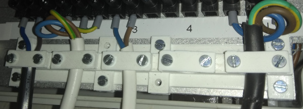
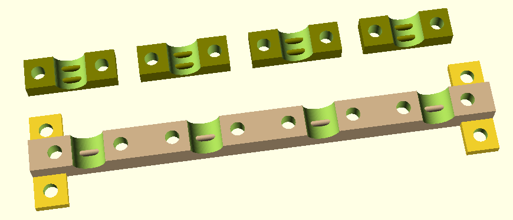
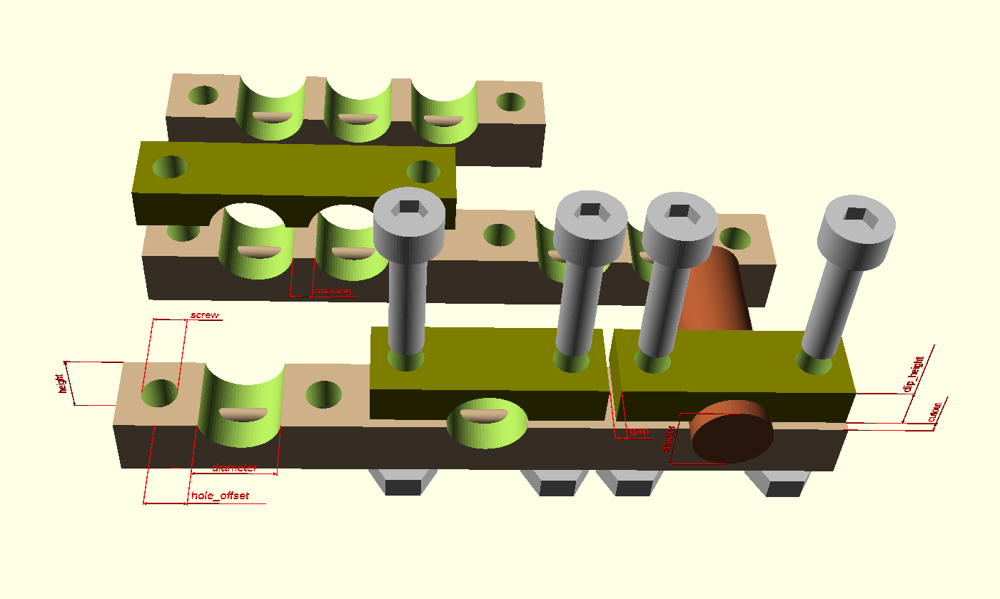

# Cable Clamps

Cable clamps of various sizes.

These cable clamps need to be integrated with other objects as
the cable clamp do not have any way of mounting them.

See the basic usage example for a version with mounting holes.



## Requires:

- BOSL: https://github.com/revarbat/BOSL

## See also:

* [Thingiverse](https://www.thingiverse.com/thing:4589487)
* Basic usage example: [cableclamp_usage.scad](../rol-usage/cableclamp_usage.scad)
* More elaborate test and dimensions: [cableclamp_test.scad](../rol-usage/cableclamp_test.scad)





## Global variables

### cable_clamp_default

The default settings for the cable clamps. See [`cable_clamp_settings()`](#cable_clamp_settings) and
[changing the cable clamp dimensions](#changing-the-cable-clamp-dimensions) for more information.


## Main modules/functions

### cable_clamp_settings

Return a vector with settings for the cable clamps. Pass this vector to all 
other modules/functions.

    function cable_clamp_settings(
      width=7,
      height=6,
      diameter=7,
      cutout=1,
      hole_offset=3,
      nut=3,
      clearance=0.1,
      min_meat=0.5,
      clip_height=3.5,
      spacing=2,
      gap=1
    );
    
See [changing the cable clamp dimensions](#changing-the-cable-clamp-dimensions) for more information
about each argument.
  
  
### cable_clamp_base

Models the base of the cable clamp.

    module cable_clamp_base(
            length,
            cables,
            perclip=1,
            settings=cable_clamp_default
    );

argument | description 
---------|------------
length   | The length of the cable clamp. Leave undef to automatically determine the length based on the number of cables.
cables   | The number of cables for this clamp.
perclip  | Number of cables per clip.
settings | All dimensions for the cable clamp.  


### cable_clamp_clip

Models a single cable clip.

    module cable_clamp_clip(
            perclip=1,
            settings=cable_clamp_default
    );

argument | description
---------|------------
perclip  | Number of cables per clip.
settings | All dimensions for the cable clamp.


## Helper modules/functions

These modules/functions are useful to get the position and lengths of various parts of the
clamps. These can be useful to retrieve the exact dimensions when integrating the 
cable clamps with other parts.

These modules/functions are used for example in cableclamp_test.scad to position the 
various parts.

### cable_clamp_base_hole

Returns the position of the center of a mounting hole for the clips.

    function cable_clamp_base_hole(
            length,
            cables,
            hole=1,
            clip=1,
            perclip=1,
            settings=cable_clamp_default
    );

argument | description
---------|------------
length   | The length of the cable clamp. Leave undef to automatically determine the length based on the number of cables.
cables   | The number of cables for this clamp.
hole     | Which hole for a single clip to return. 1 (left hole) or 2 (right hole)
clip     | The number of the clip. First clip is 1.
perclip  | Number of cables per clip.
settings | All dimensions for the cable clamp.

Returns: `[x, y, z]`
   
   
### cable_clamp_base_cable

Returns the position of the center of cable.

    function cable_clamp_base_cable(
            length,
            cables,
            cable=1,
            perclip=1,
            settings=cable_clamp_default
    );

argument | description 
---------|------------
length   | The length of the cable clamp. Leave undef to automatically determine the length based on the number of cables.
cables   | The number of cables for this clamp.
cable    | The number of the cable. 1 is the first(left) cable.
perclip  | Number of cables per clip.
settings | All dimensions for the cable clamp.
   
Returns: `[x, y, z]`


### cable_clamp_base_size

Returns the size of the cable clamp base.

    function cable_clamp_base_size(
            length,
            cables,
            perclip=1,
            settings=cable_clamp_default
    );

argument | description
---------|------------
length   | The length of the cable clamp. Leave undef to automatically determine the length based on the number of cables.
cables   | The number of cables for this clamp.
perclip  | Number of cables per clip.
settings | All dimensions for the cable clamp.

Returns: `[length, width, height]`


### cable_clamp_clip_hole

Returns the position of the center of the mounting hole of the clip.

    function cable_clamp_clip_hole(
                hole=1,
                perclip=1,
                settings=cable_clamp_default
    );

argument | description
---------|------------
hole     | The number of the hole. 1 is the left hole, 2 is the right hole.
perclip  | Number of cables per clip.
settings | All dimensions for the cable clamp.

Returns: `[x, y, z]`
    
    
### cable_clamp_clip_cable

Returns the position of the center of the cable.

    function cable_clamp_clip_cable(
            perclip=1,
            cable=1,
            settings=cable_clamp_default
    );

argument | description
---------|------------
cable    | The number of the cable. The left most cable is 1.
perclip  | Number of cables per clip.
settings | All dimensions for the cable clamp.
    
Returns: `[x, y, z]`
    
    
### cable_clamp_clip_size

Returns the size of the cable clamp clip.

    function cable_clamp_clip_size(
              perclip=1,
              settings=cable_clamp_default
    );

argument | description
---------|------------
perclip  | Number of cables per clip.
settings | All dimensions for the cable clamp.
    
Returns: `[length, width, height]`


### cable_clamp_xoffset

Returns the offset on the X-axis to line up a cable clip to a cable clamp.

    function cable_clamp_xoffset(
              cables,
              length,
              clip,
              perclip=1,
              settings=cable_clamp_default
    );
  
argument | description
---------|------------
length   | The length of the cable clamp. Leave undef to automatically determine the length based on the number of cables.
cables   | The number of cables for this clamp.
clip     | The number of the clip. 1 is the left most clip.
perclip  | Number of cables per clip.
settings | All dimensions for the cable clamp.
  
  
## Changing the cable clamp dimensions

To use your own dimensions, use the `cable_clamp_settings` function to
create a vector with the settings and pass this vector as the `settings`
argument to all other functions/modules.

For more details about the dimensions, render the cableclamp_test.scad or see 
the "drawings" and examples below.

```
single clamp
       hole_offset
 hole_offset   |   diameter
         |<->|<->|<->|                         
     ___ _______________            
      ^ |        |||||         
width | |    O   =====  O    
     _v_|________|||||__ 
             |     |
             |<-f->|

                 diameter    gap
                     |<->| >||<
            _v___  _________  _________
 clip_height | i_ |   ___   ||   ___   |  _______________
            _|___ |__/   \__||__/   \__|  __v_         ^
      _v_____^___  __     ______     ___  __|_ cutout  |diameter
 height|          |  \___/      \___/     __^__v_______v_
      _|_________ |_____________________  _____|_ b
       ^               |          |            ^
                       |<-------->|
                       single_length
                       
double clamp                       
                       
  diameter    spacing  gap
        |<->|<>|     >||<
      ________________  _________
     |   ___    ___   ||   ___
     |__/   \__/   \__||__/   \__
      __     __     ______     __
     |  \___/  \___/      \___/
     |____________________________
     |    |                 |
          |<--------------->|
             single_length
  
      hole_offset  diameter
hole_offset    |    |   spacing
        |<-->|<-->|<->|<>|
         _______________________________
        |         |||||  |||||          |||  
        |    O    |||||  |||||   O   O  |||  
        |_________|||||__|||||_________ |||__

```
                          
