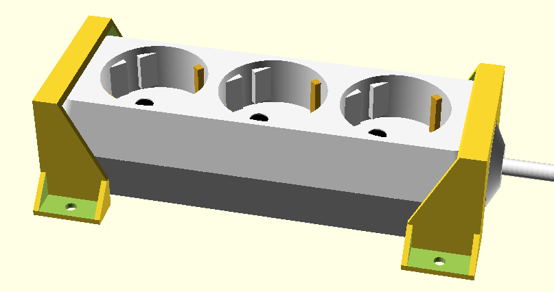
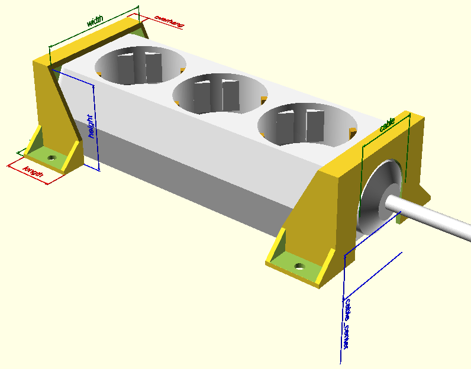

# Power strip holder.

Most readily available power strips do not have any way of mounting them.
These are holders to mount a power strip onto something.

# See also:

* [Thingiverse](https://www.thingiverse.com/thing:4590509)
* Code: [powerstripholder.scad](../parts/powerstripholder.scad)

# Requires

- BOSL: https://github.com/revarbat/BOSL (only used to render the power 
  strip in the example)
- dimensions.scad: to draw the dimensions (not needed for the actual holders)

# Arguments

- `width`: The width of the power strip (make sure its a bit oversize)
- `height`: The height of the power strip (make sure its a bit oversize)
- `overhang`: The size of the lip on top which keeps the power strip in place.
- `wall`: Wall thickness. 2mm seems to be fine.
- `length`: The length of the feet.
- `base`: The width of the feet.
- `cable`: The diameter of the cable hole or undef for no hole.
- `cable_center`: The center of the cable.
- `screw`: The size of the screw holes.

